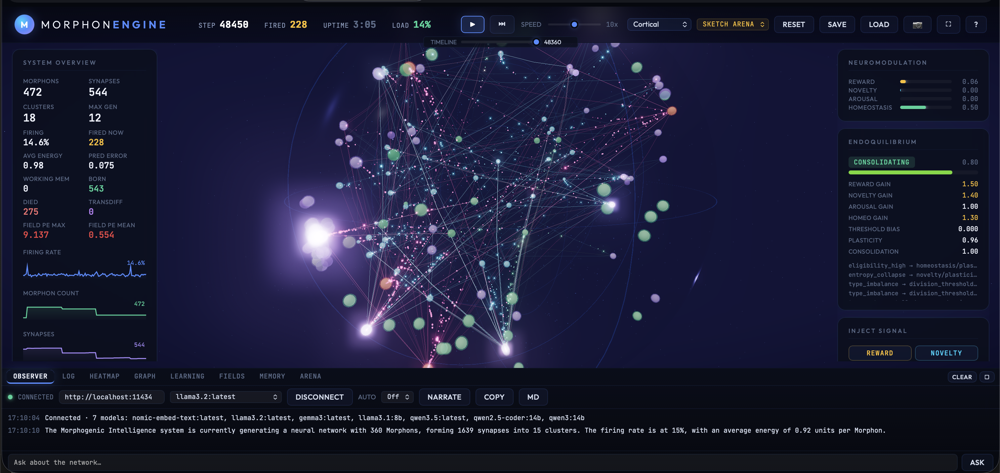
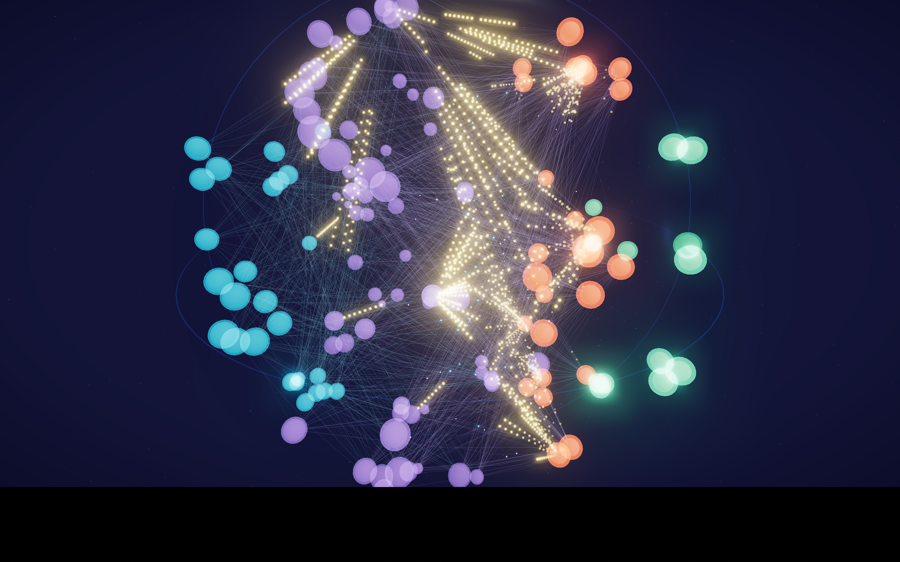
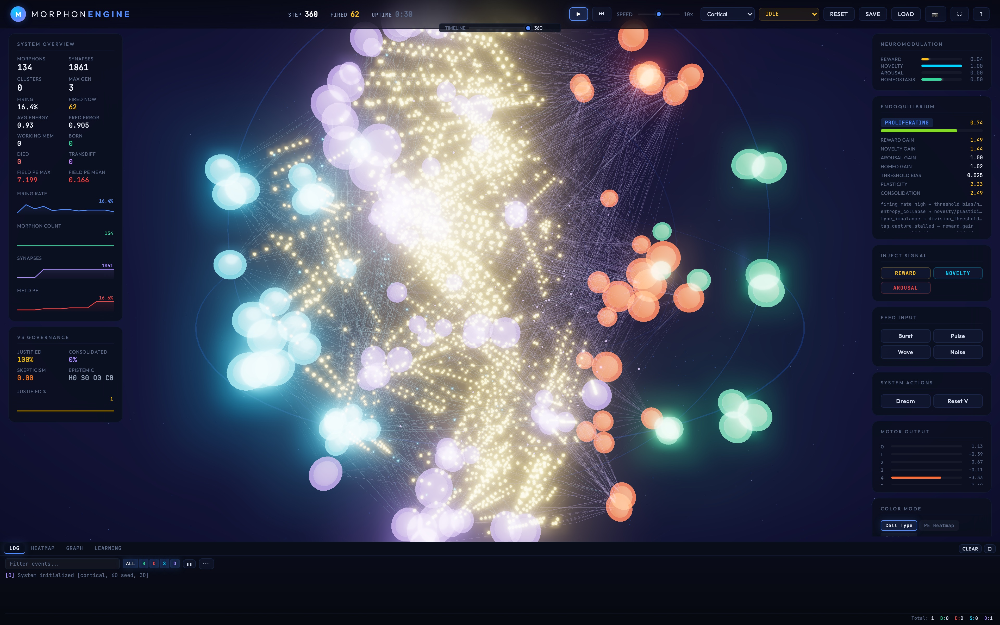

<p align="center">
  
</p>

# Morphon-Core

**Morphogenic Intelligence Engine — adaptive AI systems that grow, learn, and self-organize at runtime**

Morphon-Core is a biologically-inspired, adaptive intelligence engine that implements Morphogenic Intelligence: systems that grow, self-organize, and learn at runtime without backpropagation.

> **⚠️ Research preprint codebase.** This is the reference implementation for the paper
> [*Morphogenic Intelligence: Runtime Neural Development Beyond Static Architectures*](docs/paper/paper/Morphogenic_Intelligence.pdf)
> (v2, April 2026). It is actively developed, APIs are not stable, and benchmark numbers are
> not cross-version comparable. This is not production software. See [`CHANGELOG.md`](CHANGELOG.md)
> for the version history and [`CONTRIBUTING.md`](CONTRIBUTING.md) for how to report issues.


*The in-browser WASM visualizer during a MNIST training run (Consolidating stage, 4858 ticks, 14% firing rate). Spheres are morphons colored by cell type; lines are active synaptic connections; the bright cluster at center is a high-activity associative region. The 3D layout is the Poincaré ball embedding.*

## Headline Results

| Benchmark | Result | Notes |
|-----------|--------|-------|
| **CartPole-v1** | **SOLVED** avg=195.2 | v0.5.0 standard profile (1000 ep). Reproduced at v4.1.0 (avg=195.5). |
| **MNIST — stateless** | **87.0% mean** (87.7% peak) | V3-SL, standard profile, 5 seeds. Stateless = state reset before each test image. |
| **MNIST — online** | ~43–45% | Standard profile sequential eval (stateful). |
| **MNIST — post-recovery** | ~39–44% online | After 30% associative-morphon damage + 1-epoch regrowth. Consistent recovery across 4/5 seeds. |
| **Drone3D — hover** | avg=91.5 steps | Standard profile (1000 ep, altitude waypoints), avg 3D position error 1.17m. |

See [`docs/BENCHMARKS.md`](docs/BENCHMARKS.md) for the full benchmark guide.

## Key Findings

### Stateless Training (V3-SL)

Training the readout without carrying system state between images — each sample presented to a freshly-reset network — decouples representation learning from sequential context. V3-SL lifts MNIST stateless accuracy from ~82% (V3) to **87%** (5-seed mean, standard profile) while running in ~60% of the wall time, because network state is never accumulated across the 5000-image training set.

### Self-Healing After Damage

After losing 30% of associative morphons, the system recovers to near-intact online accuracy within one additional epoch. Damage forces Endoquilibrium back into the high-plasticity Differentiating stage (plasticity_mult=2.16), and regrowth produces better-specialized morphons than the original trajectory. Recovery consistently exceeds damaged baseline across seeds (mean +14.8pp recovery over damaged), confirming the mechanism is not random luck — the forced developmental restart is doing real work.

### The Spike-vs-Analog Gap

Morphon potentials carry discriminative representations that the spike pipeline cannot deliver to motor morphons intact. Spike conversion, propagation delays, leaky integration, and multi-hop accumulation are each lossy. A linear analog readout over morphon potentials is therefore the correct output mechanism for classification — not a shortcut. Biology makes the same separation: Purkinje cells in the cerebellum integrate fiber inputs in analog rather than thresholding to binary spikes for motor control.

## Key Features

- **Hyperbolic Geometry**: Morphons live in Poincaré ball space with learnable curvature per-point
- **No Backpropagation**: Credit assignment via eligibility traces + neuromodulatory broadcast + tag-and-capture
- **Multi-Temporal Processing**: Four temporal scales (fast/medium/slow/glacial) via dual-clock scheduler
- **Structural Plasticity**: Runtime synaptogenesis, pruning, migration, division, differentiation, fusion, apoptosis
- **Neuromodulation**: Four broadcast channels (Reward, Novelty, Arousal, Homeostasis)
- **Developmental Programs**: Bootstrap cortical/hippocampal/cerebellar architectures with guaranteed I/O pathways
- **Endoquilibrium**: Predictive neuroendocrine stage regulation — breaks firing-rate-zero deadlock, gates plasticity by developmental phase
- **Limbic Circuit**: Confidence-based salience detection (amygdala), per-class RPE tracking (nucleus accumbens), episodic tagging (hippocampus)
- **Triple Memory System**: Working (persistent activity), episodic (one-shot), procedural (topology snapshots)
- **Bindings**: Python (via PyO3/maturin) and WebAssembly (via wasm-bindgen) support
- **Parallel Processing**: Rayon-based parallelization on fast path (feature-gated)

## Architecture Overview

### The Six Biological Principles

| | Principle | Implementation |
|--|-----------|----------------|
| **P1** | Local computation only | No global loss, no backprop. All updates use pre/post-synaptic activity + local neuromodulators. |
| **P2** | Developmental lifecycle | Morphons are born, differentiate, mature, fuse with correlated neighbors, and die from energy starvation or inactivity. |
| **P3** | Chemical signaling | Morphogen-like signals diffuse through hyperbolic space and guide differentiation and connectivity. |
| **P4** | Neuromodulatory gating | Plasticity gated by four channels (dopamine, serotonin, ACh, norepinephrine analogues) with per-morphon receptor densities. |
| **P5** | Multi-scale memory | Synaptic (fast), structural (medium), and morphogenetic (slow) memory on separate timescales. |
| **P6** | Metabolic cost | Every morphon consumes energy each tick. Scarcity drives pruning, fusion, and apoptosis. |

### Core Loop (`System::step()`)

Four temporal scales via dual-clock scheduler:

| Scale | Default Period | Operations |
|-------|---------------|------------|
| **Fast** | 1 | Spike propagation (resonance), morphon firing, input integration |
| **Medium** | 10 | Eligibility traces, three-factor weight updates, tag-and-capture |
| **Slow** | 100 | Synaptogenesis, pruning, migration in hyperbolic space |
| **Glacial** | 1000 | Division, differentiation, fusion, apoptosis (with checkpoint/rollback) |

The three-factor weight update rule:

```
Δw = η · e · M(t)
```

where `e` is the eligibility trace (STDP coincidences), `M(t)` is the receptor-gated modulatory signal, and `η` is a per-synapse plasticity rate. No global loss, no backprop.

### Network Topology


*Morphon network after training. Purple = associative, cyan = sensory, orange = motor, green = modulatory. The 3D layout is the Poincaré ball embedding: origin = general/stem morphons, boundary = specialized. Orange motor morphons concentrate on one side and project through the synaptic web.*


*The same network during active inference in the WASM visualizer. Dotted yellow trails are action potentials propagating along axons with learned delays.*

### Endoquilibrium — Predictive Neuroendocrine Regulation

Endoquilibrium monitors seven vital signs (firing rates by cell type, eligibility density, weight entropy, energy utilization, prediction error, reward EMA), maintains dual-timescale EMAs (fast τ=50, slow τ=500), and adjusts seventeen modulation channels via proportional control.

Its most critical role: breaking the **firing-rate-zero deadlock**. Without it, associative morphons stop firing within ~50 ticks of training start — a positive-feedback failure (low FR → no eligibility → no weight updates → low FR) that no parameter tuning fixes.

Developmental stage detection (from relative reward trajectory, not absolute values):

| Stage | Trigger |
|-------|---------|
| **Proliferating** | history < 20 ticks (warmup) |
| **Stressed** | reward trend < −0.05 · \|slow EMA\| |
| **Mature** | reward stable, low cv, RPE converged or history ≥ 8000 ticks |
| **Consolidating** | reward near ceiling, stable, history ≥ 500 |
| **Differentiating** | reward actively climbing (trend > 0.05 · \|slow EMA\|) |

### Limbic Circuit — Salience, Motivation, Episodic Memory

A three-component analog of the limbic system that modulates learning intensity based on per-stimulus salience and prediction error:

- **SalienceDetector** (amygdala analog) — confidence-based salience: `1 − max_softmax_prob`. Stage-gated: suppressed during Proliferating where the model is uniformly uncertain.
- **MotivationalDrive** (nucleus accumbens analog) — per-class RPE tracking. High-surprise correct predictions deliver amplified contrastive reward: `strength = 0.5 × (1 + RPE.clamp(0,1))`.
- **EpisodicTagger** (hippocampus analog) — ring buffer of high-salience episodes for future replay, weighted by `salience × |RPE|`.

Effect: +0.13pp mean stateless accuracy over 5 seeds (87.0% vs 86.87% baseline). Stage gate prevents early-training flooding; RPE-amp gives stronger imprint to genuinely surprising correct predictions.

### Epistemic Model — Four-State Knowledge Tracking

Every cluster has an epistemic state reflecting confidence in the knowledge encoded by its synaptic topology. Features **Epistemic Scarring**: clusters repeatedly Outdated or Contested develop higher skepticism thresholds.

- **Supported**: Verified — cluster protected and stable
- **Outdated**: Evidence stale (>5000 steps without reinforcement) — unconsolidates stale synapses
- **Contested**: Conflicting evidence (>25% minority) — increases arousal for re-evaluation
- **Hypothesis**: Newly formed — boosts plasticity 1.5×

### Governance Layer — Constitutional Constraints

Hard invariants **outside the learning loop** that the system cannot modify. Only a human oracle can amend them. Biological analogy: DNA-coded checkpoint programs that epigenetic modification cannot alter.

Enforced at every structural decision point (synaptogenesis, division, fusion, apoptosis), overriding any learned behavior. Constraints include: max connectivity per morphon, max cluster size fraction, max unverified fraction, mandatory justification for motor cell types, and max morphon population cap.

### Biology-Informed Failure Modes

Four failure modes encountered during development — each has a biological parallel and a biology-derived fix:

| Failure | Symptom | Fix |
|---------|---------|-----|
| **Modulatory explosion** | Positive feedback: high reward → strong dopamine → more activity → more reward → saturation | Hill-function receptor saturation, receptor downregulation, exponential decay ("reuptake") |
| **Motor silencing** | After initial burst, motor morphons go silent; network produces zero output | Tonic baseline current injection + Endoquilibrium threshold-bias rule |
| **LTD vicious cycle** | LTD > LTP at low firing rates → global weight decay → silence → apoptosis | Turrigiano synaptic scaling + BCM-style metaplasticity thresholds |
| **Premature Mature** | Endo declares Mature at 26% accuracy; plasticity throttled to 0.60×; learning stops | RPE convergence gate + history gate (≥8000 ticks) prevents premature Mature on classification tasks |

The Premature Mature failure mode is, to our knowledge, novel: dense reward signals on classification tasks inflate the slow EMA before the system has learned anything, triggering Mature stage detection and locking learning out of the high-plasticity Differentiating regime.

## Project Structure

```
.
├── src/                 # Library source code
│   ├── system.rs        # Top-level orchestrator
│   ├── morphon.rs       # Morphon and Synapse structs
│   ├── topology.rs      # Petgraph-backed directed graph
│   ├── learning.rs      # Three-factor learning rule
│   ├── resonance.rs     # Spike propagation with delays
│   ├── morphogenesis.rs # Structural plasticity operations
│   ├── neuromodulation.rs # Four broadcast channels
│   ├── developmental.rs # Bootstrap programs
│   ├── homeostasis.rs   # Stability mechanisms
│   ├── endoquilibrium.rs # Predictive neuroendocrine regulation
│   ├── limbic.rs        # Limbic circuit (salience, RPE, episodic tagging)
│   ├── memory.rs        # Triple memory system
│   ├── diagnostics.rs   # Learning pipeline observability
│   ├── snapshot.rs      # System state serialization
│   ├── python.rs        # PyO3 bindings (feature: python)
│   └── wasm.rs          # WASM bindings (feature: wasm)
├── examples/            # Runnable examples
│   ├── cartpole.rs      # CartPole-v1 control
│   ├── mnist_v2.rs      # MNIST supervised classification
│   ├── drone.rs         # 3D quadrotor hover/navigate
│   └── anomaly.rs       # Anomaly detection
├── benches/             # Criterion benchmarks
├── tests/               # Unit and integration tests
├── web/                 # Three.js web visualizer
├── data/                # Data directory (MNIST files for examples)
├── docs/                # Documentation and benchmark results
└── scripts/             # Utility scripts
```

## Build & Test Commands

```bash
# Build optimized
cargo build --release

# All tests (unit + integration + doctest)
cargo test

# Single test
cargo test <name>

# Show stdout during tests
cargo test -- --nocapture

# Criterion benchmarks
cargo bench

# Examples with run profiles (quick is default)
cargo run --example cartpole --release              # quick
cargo run --example cartpole --release -- --standard
cargo run --example cartpole --release -- --extended
# Same for: anomaly, drone

# MNIST (requires ./data/ with MNIST files)
cargo run --example mnist_v2 --release -- --standard
cargo run --example mnist_v2 --release -- --standard --limbic   # with limbic circuit
cargo run --example mnist_v2 --release -- --standard --seed=43  # specific seed

# Python bindings
maturin develop --features python

# WASM build + serve
wasm-pack build --target web --features wasm --no-default-features
cd web && python3 -m http.server 8080
```

## Documentation

- [`docs/BENCHMARKS.md`](docs/BENCHMARKS.md) — full benchmark guide (what each example tests, how to run, expected results)
- [`docs/paper/paper/`](docs/paper/paper/) — the preprint LaTeX source, builds with `make`
- [`docs/paper/paper/Morphogenic_Intelligence.pdf`](docs/paper/paper/Morphogenic_Intelligence.pdf) — the preprint PDF (19 pages, April 2026)
- [`docs/paper/sources/`](docs/paper/sources/) — experimental findings that feed into the paper
- [`docs/specs/`](docs/specs/) — design specifications for planned features (temporal sequences, limbic circuit, NLP)
- [`docs/plans/morphon-complete-roadmap.md`](docs/plans/morphon-complete-roadmap.md) — full development roadmap
- [`docs/WHAT-IT-CAN-DO.md`](docs/WHAT-IT-CAN-DO.md) — feature overview
- [`docs/user/settings.mdx.md`](docs/user/settings.mdx.md) — full `SystemConfig` reference
- [`docs/morphogenic-intelligence-concept.md`](docs/morphogenic-intelligence-concept.md) — the conceptual introduction

## Citation

If you use Morphon-Core in research, please cite:

**Paper (preprint):** [Morphogenic Intelligence: Runtime Neural Development Beyond Static Architectures](https://doi.org/10.5281/zenodo.19467243) — Zenodo DOI `10.5281/zenodo.19467243`

```bibtex
@misc{welsch2026morphogenic,
  author       = {Welsch, Lisa and Kwiecień, Martyna},
  title        = {Morphogenic Intelligence: Runtime Neural Development
                  Beyond Static Architectures},
  year         = {2026},
  publisher    = {Zenodo},
  doi          = {10.5281/zenodo.19467243},
  url          = {https://doi.org/10.5281/zenodo.19467243}
}
```

## Contact

Questions, feedback, collaboration ideas, bug reports, or just curious — we'd love to hear from you.

- **Lisa Welsch** — [lisa@tastehub.io](mailto:lisa@tastehub.io)
- **Martyna Kwiecień** — [martyna@tastehub.io](mailto:martyna@tastehub.io)
- **Issues**: [github.com/SimplyLiz/Morphon-OSS/issues](https://github.com/SimplyLiz/Morphon-OSS/issues) — for bug reports and feature requests
- **Discussions**: [github.com/SimplyLiz/Morphon-OSS/discussions](https://github.com/SimplyLiz/Morphon-OSS/discussions) — for questions, ideas, and conversations

We may be slow to respond but we read everything.

## License

Apache-2.0

## Version

4.9.0 (see Cargo.toml)
