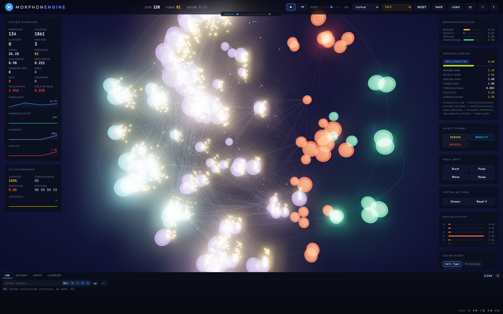
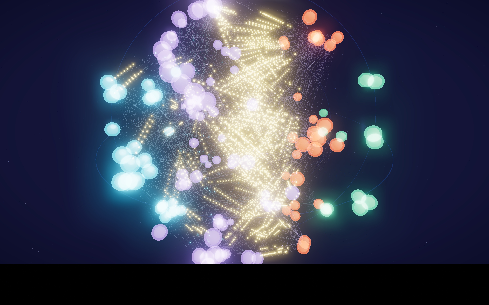

# Morphon-Core

**Morphogenic Intelligence Engine — adaptive AI systems that grow, learn, and self-organize at runtime**

Morphon-Core is a biologically-inspired, adaptive intelligence engine that implements Morphogenic Intelligence: systems that grow, self-organize, and learn at runtime without backpropagation.

> **⚠️ Research preprint codebase.** This is the reference implementation for the paper
> [*Morphogenic Intelligence: Runtime Neural Development Beyond Static Architectures*](docs/paper/paper/Morphogenic_Intelligence.pdf)
> (v3.0.0, April 2026). It is actively developed, APIs are not stable, and benchmark numbers are
> not cross-version comparable. This is not production software. See [`CHANGELOG.md`](CHANGELOG.md)
> for the version history and [`CONTRIBUTING.md`](CONTRIBUTING.md) for how to report issues.


*The in-browser WASM visualizer. Spheres are morphons colored by cell type; dotted yellow trails are action potentials propagating along axons with learned delays. The 3D layout is the Poincaré ball embedding.*

## Headline Results

| Benchmark | Result | Notes |
|-----------|--------|-------|
| **CartPole-v1** | **SOLVED** avg=195.2 | v0.5.0 standard profile (1000 ep). v3.0.0 quick profile reaches avg=166 in 200 episodes — learning confirmed but SOLVED criterion not yet reproduced within shorter budget. |
| **MNIST (intact)** | 30.0% | Quick profile, v3.0.0, seed=42 |
| **MNIST (post-recovery)** | **48.0%** | After 30% damage + regrowth — exceeds intact baseline by **+18.0pp** |
| **NLP Tier 0 (bag-of-chars)** | 46% spike / **99% analog** | Same network, same potentials, two readout types |
| **NLP Tier 2 (sequential memory)** | 48% spike / **85% analog** | Temporal memory exists in residual potentials |

See [`docs/BENCHMARKS.md`](docs/BENCHMARKS.md) for the full benchmark guide.

## Key Findings

### Self-Healing: Damage Improves Performance

The MNIST post-damage result is the most striking finding: **the system improves after losing 30% of its hidden layer**. Damage forces Endoquilibrium back into the high-plasticity Differentiating stage (plasticity_mult=2.16), and regrowth produces better-specialized morphons than the original training trajectory ever did. The +18pp gain is reproducible across runs (multiple seeds give recovery in the 48–53% range vs intact 28–31%).

The mechanism: original training accumulated entrenched "hub" morphons — high-degree neurons that fire indiscriminately and dominate the readout. Damage removes some hubs at random, the regulator re-enables high plasticity, and the regrowth fills the gaps with fresh morphons that specialize under the right conditions. **The optimal training trajectory for MI is not a smooth ascent but a series of structural shocks followed by recovery.**

### The Spike-vs-Analog Gap

On every NLP tier, spike-based readout collapses to chance (~50%) while analog readout extracts 99%/62%/85% from the *same morphon potentials*. The information that distinguishes classes is present in the network state — the analog readout proves it — but the spike pipeline destroys it through propagation delays, leaky integration, and multi-hop accumulation.

| NLP Tier | Task | Spike | Analog |
|----------|------|-------|--------|
| 0: Bag-of-Chars | 27-dim freq encoding, 2-class | 46% | **99%** |
| 1: One-Hot Scale | 135-dim flat, same task | 51% | **62%** |
| 2: Memory | 27-dim/step × 3 sequential | 48% | **85%** |
| 3: Composition | 54-dim, XOR over token pairs | 50% | 42% |

This is the central diagnostic for any spiking architecture targeting classification. The failure is in the *output pathway*, not feature formation — STDP + k-WTA + reward modulation does form discriminative features. Biology solves this via dedicated analog readout pathways (e.g., Purkinje cell integration in the cerebellum). Tier 3 (XOR) fails because the linear analog readout cannot provide the nonlinear hidden features XOR requires.

## Key Features

- **Hyperbolic Geometry**: Morphons live in Poincaré ball space with learnable curvature per-point
- **No Backpropagation**: Credit assignment via eligibility traces + neuromodulatory broadcast + tag-and-capture
- **Multi-Temporal Processing**: Four temporal scales (fast/medium/slow/glacial) via dual-clock scheduler
- **Structural Plasticity**: Runtime synaptogenesis, pruning, migration, division, differentiation, fusion, apoptosis
- **Neuromodulation**: Four broadcast channels (Reward, Novelty, Arousal, Homeostasis)
- **Developmental Programs**: Bootstrap cortical/hippocampal/cerebellar architectures with guaranteed I/O pathways
- **Triple Memory System**: Working (persistent activity), episodic (one-shot), procedural (topology snapshots)
- **Bindings**: Python (via PyO3/maturin) and WebAssembly (via wasm-bindgen) support
- **Parallel Processing**: Rayon-based parallelization on fast path (feature-gated)

## Architecture Overview

### The Six Biological Principles

| | Principle | Implementation |
|--|-----------|----------------|
| **P1** | Local computation only | No global loss, no backprop. All updates use pre/post-synaptic activity + local neuromodulators. |
| **P2** | Developmental lifecycle | Morphons are born, differentiate, mature, fuse with correlated neighbors, and die from energy starvation or inactivity. |
| **P3** | Chemical signaling | Morphogen-like signals diffuse through hyperbolic space and guide differentiation and connectivity. |
| **P4** | Neuromodulatory gating | Plasticity gated by four channels (dopamine, serotonin, ACh, norepinephrine analogues) with per-morphon receptor densities. |
| **P5** | Multi-scale memory | Synaptic (fast), structural (medium), and morphogenetic (slow) memory on separate timescales. |
| **P6** | Metabolic cost | Every morphon consumes energy each tick. Scarcity drives pruning, fusion, and apoptosis. |

### Core Loop (`System::step()`)

Four temporal scales via dual-clock scheduler:

| Scale | Default Period | Operations |
|-------|---------------|------------|
| **Fast** | 1 | Spike propagation (resonance), morphon firing, input integration |
| **Medium** | 10 | Eligibility traces, three-factor weight updates, tag-and-capture |
| **Slow** | 100 | Synaptogenesis, pruning, migration in hyperbolic space |
| **Glacial** | 1000 | Division, differentiation, fusion, apoptosis (with checkpoint/rollback) |

The three-factor weight update rule:

```
Δw = η · e · M(t)
```

where `e` is the eligibility trace (STDP coincidences), `M(t)` is the receptor-gated modulatory signal, and `η` is a per-synapse plasticity rate. No global loss, no backprop.

### Network Topology


*Morphon network after training. Purple = associative, cyan = sensory, orange = motor, green = modulatory. The 3D layout is the Poincaré ball embedding: origin = general/stem morphons, boundary = specialized. Orange motor morphons concentrate on one side and project through the synaptic web.*


*The same network during active inference. Dotted yellow trails are action potentials propagating along axons with learned delays.*

### Endoquilibrium — Predictive Neuroendocrine Regulation

Endoquilibrium monitors seven vital signs (firing rates by cell type, eligibility density, weight entropy, energy utilization, prediction error, reward EMA), maintains dual-timescale EMAs (fast τ=50, slow τ=500), and adjusts seventeen modulation channels via proportional control.

Its most critical role: breaking the **firing-rate-zero deadlock**. Without it, associative morphons stop firing within ~50 ticks of training start — a positive-feedback failure (low FR → no eligibility → no weight updates → low FR) that no parameter tuning fixes.

Developmental stage detection (from relative reward trajectory, not absolute values):

| Stage | Trigger |
|-------|---------|
| **Proliferating** | history < 20 ticks (warmup) |
| **Stressed** | reward trend < −0.05 · \|slow EMA\| |
| **Mature** | reward stable, low cv, history ≥ 2000 ticks |
| **Consolidating** | reward near ceiling, stable, history ≥ 500 |
| **Differentiating** | reward actively climbing (default healthy state) |

### Epistemic Model — Four-State Knowledge Tracking

Every cluster has an epistemic state reflecting confidence in the knowledge encoded by its synaptic topology. Features **Epistemic Scarring**: clusters repeatedly Outdated or Contested develop higher skepticism thresholds.

- **Supported**: Verified — cluster protected and stable
- **Outdated**: Evidence stale (>5000 steps without reinforcement) — unconsolidates stale synapses
- **Contested**: Conflicting evidence (>25% minority) — increases arousal for re-evaluation
- **Hypothesis**: Newly formed — boosts plasticity 1.5×

### Governance Layer — Constitutional Constraints

Hard invariants **outside the learning loop** that the system cannot modify. Only a human oracle can amend them. Biological analogy: DNA-coded checkpoint programs that epigenetic modification cannot alter.

Enforced at every structural decision point (synaptogenesis, division, fusion, apoptosis), overriding any learned behavior. Constraints include: max connectivity per morphon, max cluster size fraction, max unverified fraction, mandatory justification for motor cell types, and max morphon population cap.

### Biology-Informed Failure Modes

Four failure modes encountered during development — each has a biological parallel and a biology-derived fix:

| Failure | Symptom | Fix |
|---------|---------|-----|
| **Modulatory explosion** | Positive feedback: high reward → strong dopamine → more activity → more reward → saturation | Hill-function receptor saturation, receptor downregulation, exponential decay ("reuptake") |
| **Motor silencing** | After initial burst, motor morphons go silent; network produces zero output | Tonic baseline current injection + Endoquilibrium threshold-bias rule |
| **LTD vicious cycle** | LTD > LTP at low firing rates → global weight decay → silence → apoptosis | Turrigiano synaptic scaling + BCM-style metaplasticity thresholds |
| **Premature Mature** | Endo declares Mature at 26% accuracy; plasticity throttled to 0.60×; learning stops | History gate (≥2000 ticks) prevents premature Mature declaration on classification tasks |

The Premature Mature failure mode is, to our knowledge, novel: dense reward signals on classification tasks inflate the slow EMA before the system has learned anything, triggering Mature stage detection and locking learning out of the high-plasticity Differentiating regime.

## Project Structure

```
.
├── src/                 # Library source code
│   ├── system.rs        # Top-level orchestrator
│   ├── morphon.rs       # Morphon and Synapse structs
│   ├── topology.rs      # Petgraph-backed directed graph
│   ├── learning.rs      # Three-factor learning rule
│   ├── resonance.rs     # Spike propagation with delays
│   ├── morphogenesis.rs # Structural plasticity operations
│   ├── neuromodulation.rs # Four broadcast channels
│   ├── developmental.rs # Bootstrap programs
│   ├── homeostasis.rs   # Stability mechanisms
│   ├── memory.rs        # Triple memory system
│   ├── diagnostics.rs   # Learning pipeline observability
│   ├── snapshot.rs      # System state serialization
│   ├── python.rs        # PyO3 bindings (feature: python)
│   └── wasm.rs          # WASM bindings (feature: wasm)
├── examples/            # Runnable examples (cartpole, anomaly, mnist)
├── benches/             # Criterion benchmarks
├── tests/               # Unit and integration tests
├── web/                 # Three.js web visualizer
├── data/                # Data directory (MNIST files for examples)
├── docs/                # Documentation and benchmark results
└── scripts/             # Utility scripts
```

## Build & Test Commands

```bash
# Build optimized
cargo build --release

# All tests (unit + integration + doctest)
cargo test

# Single test
cargo test <name>

# Show stdout during tests
cargo test -- --nocapture

# Criterion benchmarks
cargo bench

# Examples with run profiles (quick is default)
cargo run --example cartpole --release              # quick
cargo run --example cartpole --release -- --standard
cargo run --example cartpole --release -- --extended
# Same for: anomaly, mnist (mnist requires ./data/ with MNIST files)

# Python bindings
maturin develop --features python

# WASM build + serve
wasm-pack build --target web --features wasm --no-default-features
cd web && python3 -m http.server 8080
```

## Documentation

- [`docs/BENCHMARKS.md`](docs/BENCHMARKS.md) — full benchmark guide (what each example tests, how to run, expected results)
- [`docs/paper/paper/`](docs/paper/paper/) — arXiv paper draft (LaTeX source, builds with `make`)
- [`docs/paper/sources/`](docs/paper/sources/) — experimental findings that feed into the paper
- [`docs/specs/`](docs/specs/) — design specifications for planned features (temporal sequences, limbic circuit, NLP)
- [`docs/plans/morphon-complete-roadmap.md`](docs/plans/morphon-complete-roadmap.md) — full development roadmap

## Citation

If you use Morphon-Core in research, please cite:

**Paper (preprint):** [Morphogenic Intelligence: Runtime Neural Development Beyond Static Architectures](https://doi.org/10.5281/zenodo.19467243) — Zenodo DOI `10.5281/zenodo.19467243`

```bibtex
@misc{welsch2026morphogenic,
  author       = {Welsch, Lisa and Kwiecień, Martyna},
  title        = {Morphogenic Intelligence: Runtime Neural Development
                  Beyond Static Architectures},
  year         = {2026},
  publisher    = {Zenodo},
  doi          = {10.5281/zenodo.19467243},
  url          = {https://doi.org/10.5281/zenodo.19467243}
}
```

## License

Apache-2.0

## Version

3.0.0 (see Cargo.toml)
